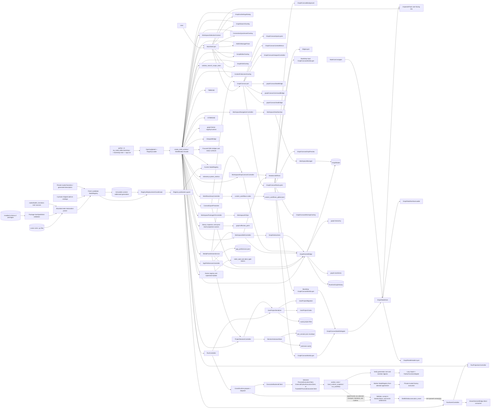
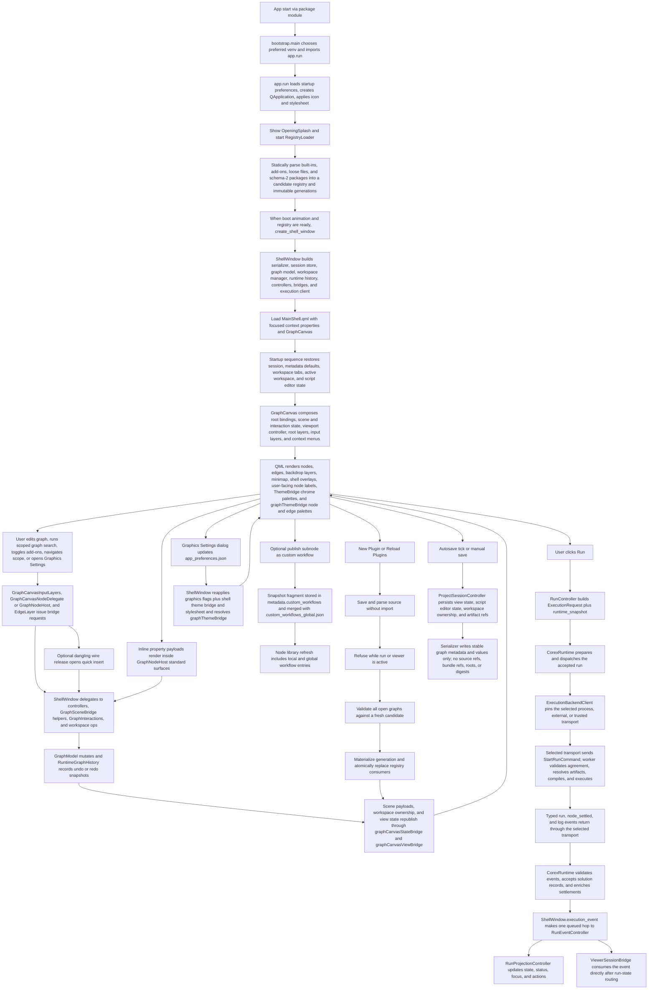
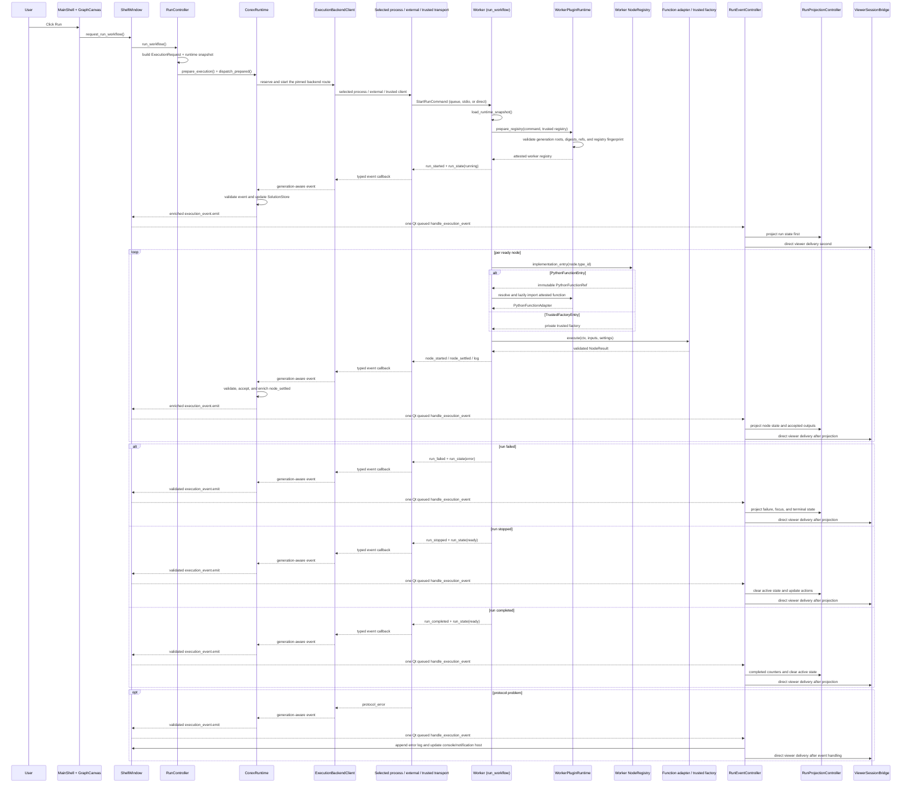

# COREX Node Editor Architecture (Plain English)

## Purpose of this document
This file explains how COREX Node Editor is structured, how runtime data moves through the app, and where to make changes safely.
It is a practical map for engineers working in this repository.

## Architecture navigation entry path
Before changing a cross-layer feature, start from
[`docs/agent_maps/INDEX.md`](docs/agent_maps/INDEX.md) and the matching coverage
row, then use [`docs/specs/INDEX.md`](docs/specs/INDEX.md) for requirements and
retained proof. Historical work-packet records live in Git history; they are not
a current implementation router.

## What this app does
COREX Node Editor is a desktop visual workflow editor that:
- lets users build node graphs on a QML canvas,
- supports passive visual authoring families for flowcharts, planning boards, annotations, and local media panels on the same canvas,
- supports nested subnode scopes (graph hierarchy),
- executes workflows in a separate worker process,
- persists projects as versioned `.cxproj` JSON with optional sibling `.data` managed-file sidecars,
- persists app-wide graphics, shell-theme, and graph-theme preferences as versioned `app_preferences.json`,
- ships repo-local dependency-gated add-ons such as Tabular Data and MARS,
- supports statically discovered function plugins written with the public `corex` SDK,
- publishes/imports reusable custom workflow snapshots and merges project-local plus user-global workflow libraries,
- restores sessions/autosaves and reports runtime status/metrics.

## Big picture
The app is split into clear parts:

- `ea_node_editor/ui` + `ea_node_editor/ui_qml`: shell window, QML shell/canvas composition, bridges, and UI models.
- `ea_node_editor/ui/shell/controllers`: orchestration split into app-preferences, run, project/session, and workspace/library controllers.
- `ea_node_editor/ui/theme`: shared theme registry, token sets, QWidget stylesheet generation, and QML palette bridge inputs.
- `ea_node_editor/ui/graph_theme`: graph-theme registry, token sets, runtime resolution, and node/edge presentation helpers.
- `ea_node_editor/graph`: in-memory graph domain (`ProjectData`, `WorkspaceData`, nodes, edges, views), hierarchy helpers, and graph transforms.
- `ea_node_editor/addons`: repo-local add-on catalog, enablement state, hot-apply lifecycle, and optional add-ons such as Tabular Data and MARS.
- `corex`: the dependency-free public function/decorator SDK.
- `ea_node_editor/nodes`: static declaration parsing, private registry contracts, built-ins, immutable plugin generations, and schema-2 package import/export.
- `ea_node_editor/execution`: runtime-snapshot assembly, UI client, worker process, and typed command/event protocol.
- `ea_node_editor/persistence`: current-schema validation, overlay/artifact codecs, serializer, and session/autosave storage.
- `ea_node_editor/custom_workflows`: project-local metadata codec, user-global library store, and `.cxwf` import/export.
- `ea_node_editor/workspace`: workspace ordering, metadata ownership normalization, and lifecycle manager.
- `ea_node_editor/telemetry`: system metrics.

Design intent:
- QML renders and captures interaction.
- `GraphCanvas.qml` composes focused root/state/controller modules (`GraphCanvasInteractionState`, `GraphCanvasSceneState`, the shared facts objects `GraphCanvasExecutionFacts`/`GraphCanvasPreferenceFacts`, `GraphCanvasNodeSurfaceBridge`, `GraphCanvasViewportController`, `GraphCanvasSceneLifecycle`, `GraphCanvasRootLayers`, `GraphCanvasInputLayers`, `GraphCanvasContextMenus`).
- `GraphCanvasRootLayers.qml` owns the live background, backdrop, edge, drop-preview, node-world, toolbar, and minimap layering instead of keeping that list inline in `GraphCanvas.qml`.
- `GraphCanvasWorldLayer.qml` repeats `GraphCanvasNodeDelegate.qml`, which hosts `GraphNodeHost.qml`; `NodeCard.qml` is now the standard-surface wrapper rather than the active canvas delegate.
- `GraphScenePayloadBuilder` separates `group_backdrop` payloads into `backdrop_nodes_model`, and `GraphCanvas.qml` renders that model on a dedicated layer below `graphCanvasEdgeLayer` and the regular node repeater so grouping surfaces stay visually behind ordinary nodes and note-style annotations.
- Groups render as paired main and input-overlay delegates, and `GraphCanvasNodeDelegate.qml` mirrors live geometry into both hosts so resize and drag feedback stay synchronized during interaction.
- `GraphNodeHost.qml` keeps node-body drag/select/open/context behavior below the loaded surface content, and graph surfaces publish local ownership through `embeddedInteractiveRects` instead of relying on click-swallowing top overlays.
- `GraphNodeHeaderLayer.qml` owns the single shared inline title editor for standard cards, passive surfaces, collapsed nodes, and scope-capable shells; `GraphCanvas.qml` routes header title commits back onto the existing rename/mutation-history authority instead of introducing a surface-local title workflow.
- Shell overlays remain shell-owned in `MainShell.qml`; `GraphSearchOverlay`, `ConnectionQuickInsertOverlay`, `AddOnManagerPane`, `ScriptEditorOverlay`, `GraphHintOverlay`, and `ContentFullscreenOverlay` are siblings rather than canvas-local widgets.
- `ShellWindow` remains the QObject/QMainWindow parent and lifecycle host, but focused bridges and native hosts do not use it as a capability lookup. `ContentFullscreenBridge` receives live model/registry/workspace/project providers plus exact scene, viewer-session, run-state, script-editor, dialog, trim, and Web-artifact owners. The same runtime composition root injects execution/workspace providers into `ViewerSessionBridge`; live active-workspace/model/registry providers, preferences, save callback, and the direct viewer host into `ViewerControlBridge`; QML-engine/save/bookmark callbacks into `ViewerHostService`; and the active-workspace provider into `PlotHostService`. Model and registry providers remain dynamic across replacement. Exactly two bounded late callbacks break the real construction cycles: session camera capture to the later viewer host and viewer-host PageUp/PageDown bookmark cycling to the later control bridge.
- `ViewerHostService` and `PlotHostService` each own a distinct plain `NativePresentationHandoff`. It owns only preview-swap pending records/serials, expected-source gating, the single `afterRendering` connection, timeout/cancel/flush/shutdown, and queued completion. Viewer capture/bridge demotion and plot capture/overlay release remain host callbacks; binder registries, widget priority (`fullscreen > detached > inline`), detached windows, camera/selection, plot backend policy, and overlay geometry remain separate.
- App-wide graphics settings live in versioned `app_preferences.json` through `AppPreferencesController`, which owns persistence and normalization. `ShellWorkspacePresenter` is the single runtime projection, mutation, notification, and tooltip-cache owner; neither project `.cxproj` metadata nor `last_session.json` owns graphics state.
- Shared shell-theme resolution feeds both the QApplication stylesheet and QML `ThemeBridge.palette`, so shell and canvas chrome surfaces switch themes together at runtime.
- Dedicated graph-theme resolution feeds QML `graphThemeBridge`, so graph item surfaces (`GraphNodeHost`/`NodeCard`, `EdgeLayer`, category accents, and port-kind rendering) can follow the shell theme by default or switch to explicit/custom graph themes without changing canvas chrome.
- User-facing shell surfaces prefer node titles and per-type sequential IDs; raw internal `node_id` values stay as internal references.
- `GraphModel` remains the canonical mutable graph state for both runtime nodes and passive visual nodes; passive items stay under `WorkspaceData.nodes` / `WorkspaceData.edges` instead of introducing a second artifact store.
- Passive `flow` edges are graph-authoring artifacts only: they support labels, branch styling, and multi-incoming targets where the registry allows it, but the compiler/worker drop them before runtime execution.
- Hierarchy is explicit via `NodeInstance.parent_node_id` and per-view `scope_path`.
- Undo/redo is managed by `RuntimeGraphHistory` snapshots.
- Runs build `RuntimeSnapshot` payloads plus a bounded registry/plugin agreement before crossing into the worker process; `project_path` is retained only as artifact-resolution context.
- Serializer/current-schema validation keeps persisted projects deterministic at `SCHEMA_VERSION = 5`, including passive visual metadata and project-local `metadata.ui.passive_style_presets`; pre-current documents require an offline conversion before load.

## Shell/scene boundary ownership

- `MainShell.qml` remains the composition root for shell chrome and shell-owned overlays, but current QML binds to focused bridges instead of raw host globals.
- `shellLibraryBridge` owns library search/filter state, graph-search results, quick-insert candidates, and hint/insert shell overlays for QML consumers.
- `shellWorkspaceBridge` owns workspace tabs, title/run/console state, and the `ShellWorkspacePresenter` projections and mutations for persisted graphics preferences.
- `shellInspectorBridge` owns inspector-facing selection metadata, property-edit affordances, and exposed-port presentation for inspector QML surfaces.
- `addonManagerBridge`, `contentFullscreenBridge`, `viewerSessionBridge`, `viewerHostService`, `scriptEditorBridge`, `scriptHighlighterBridge`, `statusEngine`, `statusJobs`, `statusMetrics`, `statusNotifications`, and `helpBridge` are all first-class shell-owned context surfaces bound from `ea_node_editor.ui.shell.composition`. The content bridge has no `ShellWindow` reference, policy facade, dependency bag, compatibility alias, or second QML API.
- `graphCanvasStateBridge` publishes the focused state surface consumed by `GraphCanvas.qml`: persisted graphics come only from its explicit `ShellWorkspacePresenter`, minimap/snap facts come from `ShellWindowSearchScopeState` plus the exact snap signal/size, and selected-run preview comes from `AppPreferencesController`.
- `graphCanvasViewBridge` (the `ViewportBridge` context property) owns camera/view state consumed directly by `GraphCanvas.qml` and `GraphCanvasRootLayers.qml`.
- `graphCanvasCommandBridge` owns the unchanged QML slot surface while routing each domain directly: session commands to `WindowSearchScopeController`, selected-run preferences to `AppPreferencesController`, Trigger to Program A `RunController`, scope/hints to their direct shell owners, path/color to `ShellInspectorPresenter`, Quick Insert to `ShellLibraryPresenter`, edit/drop to the T14 controllers, media to `MediaPanelActionService`, and host/cursor/preview actions to `GraphCanvasHostPresenter`. It has no `canvas_source`, shell-window fallback, or aggregate accessor.
- `MediaPanelActionService` is the sole QObject owner of Media Panel crop, frame capture, timestamp annotation, trim replace/copy, artifact staging, and trim QThread/worker lifecycle. Composition injects the scene mutation owner, direct workspace edit/drop controllers, live model/workspace/project/run/path providers, the project-session staging call, and notification callbacks. Inline commands and fullscreen trim call this service directly; playback, source resolution, and fullscreen lifecycle stay in their existing owners.
- `GraphCanvas.qml` still exposes the stable root contract methods used by shell/drop workflows (`toggleMinimapExpanded()`, `clearLibraryDropPreview()`, `updateLibraryDropPreview()`, `isPointInCanvas()`, `performLibraryDrop()`).
- `GraphCanvas.qml` composes `GraphCanvasStateBridge`, `GraphCanvasCommandBridge`, and `ViewportBridge` directly through `canvasStateBridgeRef`, `canvasCommandBridgeRef`, and `_canvasViewportBridge`; there is no aggregate canvas bridge, adapter, or context property.
- `GraphSceneBridge` remains the stable public scene contract for node/edge payloads and QML-invokable scene slots. Composition explicitly binds the `ShellWorkspacePresenter` graphics source; its payload fingerprint is `(show_port_labels, graph_label_pixel_size, node_title_icon_pixel_size, lightweight_canvas)`, so matching changes rebuild once while unrelated graphics changes do not rebuild scene models. Internal responsibility is split behind helper seams in `GraphSceneScopeSelection`, `GraphSceneMutationHistory`, and `GraphScenePayloadBuilder`.
- `ThemeBridge` continues to own shell/canvas chrome tokens, while `graphThemeBridge` owns node/edge theming so shell-theme and graph-theme responsibilities stay separate.
- Packet-owned QML should bind to the focused bridges above rather than introducing new raw host globals or reviving retired compatibility context properties.

## Graph action entry-point ownership

- The canonical high-level graph action route is `shortcut/menu/QML event -> GraphActionBridge or PyQt action dispatch -> GraphActionController -> existing behavior owner`.
- `GraphActionController` is the single coordinator for user-facing graph verbs such as copy, cut, paste, duplicate, delete, grouping, alignment, scope navigation, Group wrapping, node style commands, node rename/help, custom workflow publishing, Group Peek, and flow-edge style or removal commands.
- QML context-menu graph verbs and node-delegate graph verbs call `graphActionBridge.trigger_graph_action(actionId, payload)`. The bridge maps stable QML action IDs through `ea_node_editor.ui.shell.graph_action_contracts` and delegates to `GraphActionController`; surface-local delegate actions can still fall through to the loaded surface.
- PyQt menus, shortcuts, and host request slots dispatch through `ea_node_editor.ui.shell.window_actions` and `ea_node_editor.ui.shell.window_state.workspace_graph_actions`, then converge on the same controller instead of carrying parallel behavior.
- `Help > Keyboard and Mouse Reference` is a shell-owned, filterable dialog that documents user-facing shortcuts, mouse gestures, hidden-port decluttering gestures, context-menu gestures, and focused editor controls; it is not a behavior router and should stay synchronized with the owners listed here and in the input-layer maps.
- `GraphActionController` does not own the behavior implementation. It selects the established owner for each verb: workspace graph-edit controllers for selection/subgraph operations, `WindowSearchScopeController` plus `GraphSceneBridge` for subnode scope entry, `GraphCanvasHostPresenter` for parent/root scope navigation plus graph cursor/style/label host actions, `GraphSceneBridge` for Group Peek state, and the help or add-on bridges for their shell-owned surfaces.
- Low-level canvas operations stay outside the graph action controller. Selection mechanics, marquee hit testing, node movement, node resize, geometry commits, viewport pan/zoom, port drag/connect/drop flows, inline property and port-label commits, quick-insert overlay placement, and direct scene policy checks continue to live in `GraphCanvasCommandBridge`, `GraphCanvasStateBridge`, `ViewportBridge`, `GraphSceneBridge`, and their helper modules. Cursor-shape application and graph style/label dialogs are direct `GraphCanvasHostPresenter` responsibilities rather than `ShellWindow` or `ShellHostPresenter` facades.
- `docs/specs/perf/COREX_ARCHITECTURE_ENTRY_POINT_REDUCTION_QA_MATRIX.md` is retained as historical graph-action-route evidence; the active no-legacy closeout proof lives in `docs/specs/perf/COREX_NO_LEGACY_ARCHITECTURE_CLEANUP_QA_MATRIX.md`.

## Passive visual authoring path

- Passive nodes use the same registry and serializer path as executable nodes, but `NodeTypeSpec.runtime_behavior` marks them as `passive` so they never compile into the worker graph.
- `PortKind.flow` is the authoring-only connection kind for passive diagrams. `flow` edges remain visible, labeled, and styleable in the scene, but they do not affect Run.
- Surface routing is declarative through `surface_family` / `surface_variant`, which keeps public QML discoverability stable while letting the graph host swap between standard cards, flowchart silhouettes, planning cards, annotation notes, Groups, and media panels.
- Passive style editing is project-local. Node and flow-edge presets are stored under `metadata.ui.passive_style_presets` inside the `.cxproj` document rather than in app-wide preferences.
- Media panels resolve local filesystem sources only. Image panels display local image files, and PDF panels render a single-page QtPdf preview through the Python-side preview provider.

## Group Authoring Path

- Groups are a dedicated passive `passive.annotation.group_backdrop` surface under `Utilities > Canvas`. They stay distinct from connectable annotation cards, have the neutral passive-port contract, no Group shadow, and support library placement or wrap-selection through shortcut `C`; `Ctrl+Alt+G` and `Ctrl+Shift+G` remain structural subnode grouping shortcuts.
- Membership is derived from geometry rather than persisted member lists: the smallest fully containing Group in the same scope and parent chain owns a node or nested Group, which drives nesting, descendant drag/resize propagation, collapse-driven descendant hiding, boundary-edge rerouting, and the expanded-versus-collapsed clipboard/delete rules.
- A Group has only its hidden title property: its default title is empty, an untitled Group shows `Double click to edit title` only while selected, and double-click opens the shared title editor. Groups have no body/rich-text content or Inspector-editable properties. Serializer and clipboard fragments persist authored title, collapsed state, and geometry; derived containment metadata is stripped and recomputed on paste and load. Old external type IDs are not compatible, while tracked fixtures use the new type.

## Passive flowchart neutral-port contract

- Passive visual built-ins now store exactly four logical-flow ports with keys `top`, `right`, `bottom`, and `left`; each port is `direction="neutral"`, `kind="flow"`, `data_type="flow"`, `allow_multiple_connections=True`, and publishes a matching cardinal `side`.
- Persisted passive flow edges keep those stored cardinal keys in `source_port_key` and `target_port_key`. Legacy `flow_in`, `flow_out`, `branch_a`, and `branch_b` identities are retired; branch meaning now lives on edge labels and edge styling.
- Graph-scene and QML interaction payloads carry the same cardinal metadata. When a gesture starts from a passive neutral flow port, the live payload publishes `origin_side`, and when both endpoints are passive neutral flow ports the first selected or dragged port is authoritative as the source.
- Flowchart node surfaces anchor those four handles on the exact silhouette perimeter at the referenced cardinal side, while other passive node families anchor the same handles on their rectangular top/right/bottom/left edges. Passive logical-flow surfaces and drop previews keep raw port labels hidden instead of falling back to fixed `in` / `out` port rows.

## Graph-surface input routing

- `GraphNodeHost.qml` owns node-body gestures, but those handlers now live under the loaded surface content so graph surfaces can keep normal body drag/select/open/context behavior without sitting behind a drag-swallowing overlay.
- `GraphNodeSurfaceLoader.qml` forwards two distinct contracts from loaded surfaces:
  - `embeddedInteractiveRects` for ordinary buttons, editors, and handles that need local pointer ownership in host-local coordinates.
  - `blocksHostInteraction` for whole-surface modal tools such as crop mode.
- `embeddedInteractiveRects` is the default contract for interactive graph-surface controls. `blocksHostInteraction` is intentionally narrower and should not be used as a blanket substitute for local hit testing.
- Reusable graph-surface controls live under `ea_node_editor/ui_qml/components/graph/surface_controls/`; new interactive surfaces should reuse that kit before introducing one-off button or field implementations.
- Hover-only affordances use `HoverHandler` or `MouseArea { acceptedButtons: Qt.NoButton }`. Do not reintroduce invisible click-swallowing overlays or compatibility-only hover proxies.
- Graph-surface editors commit and browse by explicit `nodeId` bridge calls so surface editing does not depend on selected-node timing in the inspector path.

## Shared inline title workflow

- `GraphNodeHeaderLayer.qml` owns the only approved inline title editor (`graphNodeTitleEditor`). Standard executable nodes, passive families, collapsed nodes, and scope-capable shells all reuse that header editor rather than adding per-surface title controls.
- Inline header commits converge on the existing title-mutation authority. `GraphCanvas.qml` forwards the edit as a title change, and the mutation layer applies `set_node_title(...)` semantics so property-backed passive families keep `node.title` plus `properties["title"]` synchronized while standard/media/subnode nodes update only the canonical node title.
- Scope-capable subnode shells keep a dedicated `OPEN` badge in the shared header. Title double-click is edit-only; badge activation commits any in-flight title edit and then reuses `GraphCanvas.requestOpenSubnodeScope(...)` for scope entry.

## Current architecture closure snapshot

- Startup entry, app-preferences loading, and the performance harness land on explicit package seams: `ea_node_editor.bootstrap`, `ea_node_editor.app_preferences`, and `ea_node_editor.ui.perf.performance_harness` own the current startup path rather than UI-host glue.
- Startup now runs as `python -m ea_node_editor.bootstrap` or the `corex-node-editor` console command -> `ea_node_editor.bootstrap.main()` -> `ea_node_editor.app.run()`, with preferred-venv re-exec plus `OpeningSplash` and `RegistryLoader` gating `create_shell_window()`.
- Shell construction runs through `ea_node_editor.ui.shell.composition`, with `ShellWindow` acting as the QObject/QMainWindow host while focused library, navigation, graph-edit, package-IO, run, session, preferences, fullscreen, viewer, and plot owners carry orchestration.
- Current QML consumes `shellLibraryBridge`, `shellWorkspaceBridge`, `shellInspectorBridge`, `addonManagerBridge`, `graphCanvasStateBridge`, `graphCanvasCommandBridge`, `graphCanvasViewBridge`, `contentFullscreenBridge`, `viewerSessionBridge`, `viewerHostService`, `scriptEditorBridge`, `scriptHighlighterBridge`, `themeBridge`, `graphThemeBridge`, `uiIcons`, `statusEngine`, `statusJobs`, `statusMetrics`, `statusNotifications`, and `helpBridge` as the primary context surface.
- Graph authoring writes route through the authoritative mutation-service path, and runtime history captures the mutable workspace state needed for undo/redo without leaving payload normalization as a live-model side effect.
- Persistence-only overlay ownership now lives under `ea_node_editor.persistence.overlay`, current-schema `.cxproj` documents stay stable, and pre-current-schema documents are intentionally rejected on this branch rather than silently converting inside the app.
- Run flows build and submit `RuntimeSnapshot` payloads plus the immutable registry/plugin agreement; `project_doc` is rejected at the client/protocol boundary, and the worker uses `project_path` only for artifact context.
- Public plugin discovery accepts loose decorated source and installed schema-2 packages only. It statically parses source, builds a fresh candidate registry, and materializes validated bytes into immutable generations; entry points, class probing, executable manifests, and public descriptor barrels are removed.
- Oversized regression suites are split into focused modules, and `scripts/verification_manifest.py` is the canonical source for verification modes, shell-isolation catalogs, target-id prefixes, ownership specs, shell-direct unittest rerun commands, and proof-audit anchors consumed by the runner, checker, tests, and current docs.

## Current focused contracts

- Focused bridges are the QML source contract: shell, graph-canvas state, graph-canvas commands, viewport, graph actions, add-on manager, content fullscreen, viewer session/host, script, theme, status, and help surfaces are exported explicitly from `ea_node_editor.ui.shell.composition`.
- `ContentFullscreenBridge` owns exactly one active fullscreen state and payload. Candidate resolution snapshots composition-supplied live providers; plot quick controls mutate the opened node's aggregate `plot_options` once through `GraphSceneBridge`; script fullscreen retargets the existing `ScriptEditorModel`; terminal shutdown disconnects and clears without persisting after project close.
- Persistence is current-schema-only for ordinary app load. The serializer normalizes `SCHEMA_VERSION = 5` documents and rejects older schema versions rather than keeping in-app migration hooks active.
- Public plugin loading is function-only through the 17-name top-level `corex` SDK. Trusted factories, generated descriptors, and backend manifests are private implementation records for the explicit internal and shipped add-on boundary.
- Runtime execution uses snapshot-only worker payloads. `RuntimeSnapshot` is mandatory at the protocol boundary; `project_path` remains artifact-resolution context, not a rebuild source.
- Tabular runtime values cross execution, preview, and persistence-adjacent boundaries through JSON-safe `TabularDataRef` / `ArrayDataRef` payloads, not inlined DataFrames or dense arrays.
- Generic plot nodes consume `TabularDataRef` / `ArrayDataRef` directly through plot-side normalization. Tabular nodes own durable selected-column and array-slice hints, while plot nodes own `tabular_mapping` overrides and plot-type-specific series interpretation.
- Viewer state crosses process and UI boundaries through typed transport/session fields (`backend_id`, `transport`, `transport_revision`, live-open status, and blocker state). Raw PyVista/VTK objects stay worker-local or widget-local.
- The Corex runtime is available as a headless kernel through `ea_node_editor.execution.runtime`, with requests in `runtime_requests`, project loading in `project_loader`, and the `corex-runtime` entry in `runtime_cli`; the QML shell is one client of that API rather than the owner of execution behavior.
- `RuntimeBackendSpec`, `ToolchainSpec`, `ArtifactDescriptor`, and `SurfaceCapabilitySpec` are private contracts for shipped add-on preparation. Trusted add-ons may declare foreign-language toolchain requirements and prepared artifacts, but public function plugins cannot and native build execution remains outside the current runtime.
- Internal execution policy selects the bundled process, trusted in-process, or trusted add-on subprocess path explicitly, caches runtime preparation by backend selection, and keeps `Process Run` subprocess behavior behind one policy contract. It is not a public external-runner API.
- Launch, package imports, and performance harness entry points use canonical package paths: `ea_node_editor.bootstrap`, `ea_node_editor.app`, `ea_node_editor.ui.perf.performance_harness`, and explicit package modules instead of root launch/import shims.
- The clean-architecture restructure is closed on explicit owners: passive runtime contracts in `runtime_contracts`, graph mutations in graph-owned domain APIs, workspace/custom-workflow identity in `workspace` and `custom_workflows`, current-schema persistence in `persistence`, shell composition in `ea_node_editor.ui.shell.composition`, QML shell/canvas ports in focused bridge modules, node descriptors in `nodes` plus `addons`, and theme/status services in their presentation layers.
- [`COREX_NOVICE_PLUGIN_SDK_QA_MATRIX.md`](docs/specs/perf/COREX_NOVICE_PLUGIN_SDK_QA_MATRIX.md) is the current function-SDK closeout record. Earlier packet matrices remain historical evidence for the architecture state they accepted; they are not live task ledgers.
- Shell-backed regression suites still require fresh-process execution because repeated Windows Qt/QML `ShellWindow()` construction is not yet reliable in one interpreter process.

## Novice function plugin path

The public authoring route is one-way and deliberately narrow:

```text
loose decorated .py or installed schema-2 package
    -> bounded literal AST parser (no import)
    -> fresh candidate NodeRegistry
    -> immutable content-addressed generation
    -> guarded all-consumer registry replacement
    -> StartRunCommand registry/plugin agreement
    -> process worker digest attestation and lazy import
    -> PythonFunctionAdapter
```

- Public authors import only the dependency-free top-level `corex` module. Its
  exact 17 exports are function decorators plus the four allow-listed type
  names; `ea_node_editor.nodes` is internal and exposes no public class,
  descriptor, registry, factory, or backend-manifest authoring API.
- `plugin_declaration.py` shares bounded literal parsing with Python Script but
  keeps the products separate. Public declarations are never executed during
  validation, reload validation, package import, or package export.
- `plugin_loader.py` owns configured public loose files, installed schema-2
  packages, and public function publication. `function_bundle.py` checks declared
  imports and owns only shared immutable materialization/fingerprint inputs;
  `builtin_catalog.py` owns reserved declaration permission, `None` provenance,
  and trusted built-in publication; `addons/registry_contributions.py` owns
  availability-gated atomic trusted add-on publication. Accepted bytes are copied into
  `runtime/plugin_generations/<bundle-digest>/`. A
  `PythonFunctionEntry` contains only an immutable `PythonFunctionRef`; GUI
  discovery never receives the callable.
- `spec_validation.py` validates node structure and data-type references against
  the exact catalog supplied by its caller without mutating registry/catalog
  state. `instance_resolution.py` is the cycle-free direct owner for port
  validation, instance-spec resolution, dynamic groups, and resolved ports;
  registry, graph, execution, UI, and tests import it directly. `property_coercion.py`
  is the dependency-light property-value primitive. `NodeRegistry` installs
  manifest types into a staged catalog, registers staged entries, revalidates every
  surviving and new entry against that catalog, and publishes only after the
  complete transaction succeeds. `property_normalization.py` owns generic
  defaults/coercion, dynamic backing-state updates, and Select/Number Slider/Web policy.
  `NodeRegistry` retains the
  intentional catalog/spec-aware `default_properties`, `normalize_property_value`,
  and `normalize_properties` entry points without built-in-specific branches.
- Node Library filtering and category ancestors/options/tree are presentation
  concerns owned by `ui/shell/library_projection.py`. `LibraryPresenter` derives
  them from the same cached combined registry/custom-workflow items and builds one
  category tree per filtered cache request. `NodeRegistry` retains storage and
  spec/catalog resolution only; it exposes no filter/category presentation API.
- `RegistryReplacementCoordinator` refuses mutation while a run or viewer is
  active, validates every open graph against a fresh candidate, activates any
  package change reversibly, replaces registry consumers in order, retires old
  workers/caches, and rolls the filesystem and consumers back together on
  failure. Registry publication is guarded so run and viewer admission cannot
  observe a partial replacement.
- `StartRunCommand` carries bounded bundle refs, plugin/catalog fingerprints,
  the full registry contract fingerprint, and add-on runtime state. The worker
  rebuilds the trusted registry from that state, verifies the selected
  generation root and member digests, reparses the attested source, and imports
  a function only when its node executes.
- The reserved built-in generation contains 76 ordinary function entries.
  Private `TrustedFactoryEntry` descriptors/backends remain limited to the 53
  explicit internal exceptions and the two shipped add-on catalogs. This is an internal trust
  boundary, not a second public SDK.
- Project and workflow persistence stores stable type IDs, ports, properties,
  graph topology, and values only. `PythonFunctionRef`, `PluginBundleRef`,
  generation roots, source paths, and digests never enter `.cxproj`, graph
  fragments, or `.cxwf` documents.

Schema-2 `.cxpkg` archives are deterministic. `node_package.json` declares
every source, asset, module, and node identity; every member has an exact
SHA-256 digest. Import rejects schema 1, unknown manifest fields, undeclared or
duplicate members, Windows-colliding names, traversal, absolute or backslash
paths, dot segments, symlinks/hard links, encrypted entries, nested Python
packages, unsupported assets, hash mismatches, and configured member/size
limit violations. Limits are 64 KiB for the manifest, 256 KiB per Python
source, 4 MiB per asset, 128 total members including the manifest, and 16 MiB
expanded overall. Package icons come only from declared image assets inside
the attested generation; loose files use the default icon.

COREX currently executes public functions only in its bundled process worker.
The existing trusted add-on subprocess policy is not a selectable external
Python environment for public plugins. An external runner remains a future
capability: there is no interpreter picker, dependency installer, watcher,
marketplace, or compatibility shim.

## Built-in SSH/SFTP connector

The six SSH/SFTP nodes reuse COREX's normal executable-node route:

`corex function source -> static NodeTypeSpec normalization -> registry -> GraphModel -> shared canvas and Inspector projection -> RuntimeSnapshot -> process-worker function adapter`.

- `ssh_sftp.secret`, `ssh_sftp.host`, `ssh_sftp.run_command`,
  `ssh_sftp.run_script`, `ssh_sftp.upload`, and `ssh_sftp.download` are
  ordinary built-ins under `Control > SSH/SFTP`. Their COREX-aligned names,
  help text, static ports, defaults, and List/Item access are declarative
  metadata; no node-specific QML or second UI factory is involved.
- `secret_data` and `ssh_sftp_host_data` are queue-safe tagged mappings. A
  Host value carries address, port, username, private-key path, agent choices,
  and nested encrypted Secret values; it never contains a socket, Paramiko
  client, live session, or worker handle. This keeps reruns, Trigger
  publication, serialization, and worker restart deterministic.
- `PropertySpec.sensitive` and `sensitive_scope_key` extend the existing shared
  property path. The canvas and Inspector receive only
  `{has_value, scope}` and reuse one masked Replace/Clear editor. Dedicated
  graph commands protect plaintext before mutation/history capture, clear the
  stored value, or atomically decrypt/re-protect it when the scope changes;
  generic property writes reject sensitive keys.
- Persisted secret state is the ordinary JSON envelope
  `corex.protected_secret.v1` with provider `windows_dpapi`, canonical
  `CurrentUser` or `LocalMachine` scope, and base64 ciphertext. Project
  documents and undo snapshots contain that envelope, never plaintext.
  Non-Windows environments may carry the data but fail secret operations
  closed.
- The worker decrypts credentials immediately before use. Each command,
  script, upload, or download opens and closes its own Paramiko client, loads
  system known-host files, and installs `RejectPolicy`; unknown or changed
  host keys fail before authentication. COREX does not auto-trust/write host
  keys and has no system `ssh`/`scp` fallback.
- OpenSSH Agent and Pageant toggles select only the named backend. Paramiko's
  public `allow_agent` flag cannot make that distinction, so the connector
  uses the pinned Paramiko 4 agent internals and the base dependency is locked
  to `paramiko>=4,<5`.
- Commands run without PTY or stdin, use 30-second connection/channel
  timeouts and keepalive, poll cancellation, decode UTF-8 with replacement,
  cap stdout and stderr at 16 MiB each, and publish nonzero exit status as
  normal `successful=False`, exit-code, stdout, and stderr outputs.
- Scripts accept inline text or a local path up to 4 MiB, normalize line
  endings, use Bash/sh/Python/Perl or require a shebang for Custom, stage in a
  unique mode-0700 `/tmp/.corex-run-ssh-script-*` directory, and clean it in
  `finally`.
- SFTP operations reuse one client per node invocation across all sources.
  They recurse through directory contents without copying the source wrapper,
  require a directory destination for multiple or directory sources, skip
  symlinks with warnings, reject target-path escapes, commit each regular file
  through a temporary name, honor overwrite/no-replace, and count only
  committed files and bytes.
- No session pool, connector service, generic remote-endpoint framework, or
  parallel UI abstraction was introduced: the existing worker already
  supplies process isolation, cancellation, logging, and one synchronous
  plugin invocation path. The broader planned endpoint/capability contracts
  remain separate under `REQ-EXEC-020` and `REQ-INT-018`.
- The former active `hpc.submit`, `hpc.monitor`, and `hpc.fetch_result`
  built-ins are removed. `hpc.on_status` remains only as the externally owned
  historical file-format tombstone used by migration and fragment cleanup.
  Paramiko is required and collected in every package profile.

## Add-on backend preparation

- `ea_node_editor.addons.contracts.py` owns generic add-on state/presentation records, `ea_node_editor.addons.catalog` owns their dependency-gated construction and lookup, `ea_node_editor.addons.registry_contributions` owns trusted registry contributions, and `ea_node_editor.nodes.plugin_contracts.py` retains backend/manifest contracts. Public `plugin_loader.py` imports no add-on catalog/backend owner.
- The shell `Add-On Manager` entry now runs through `ea_node_editor.ui.shell.window_actions.py`, `ea_node_editor.ui.shell.window.py`, `ea_node_editor.ui.shell.presenters.addon_manager_presenter.py`, `ea_node_editor.ui_qml/shell_addon_manager_bridge.py`, and `MainShell.qml`, landing the shipped Variant 4 inspector-style right drawer with row-level `HOT`/`RESTART` badges, pending-restart banners, and explicit but still-disabled install/restart affordances.
- `ea_node_editor/persistence/project_codec.py`, `ea_node_editor/graph/registry_normalization.py`, `ea_node_editor/ui_qml/graph_scene_payload/`, `ea_node_editor/ui_qml/components/graph/GraphNodeHost.qml`, `GraphNodeHeaderLayer.qml`, and `GraphCanvasContextMenus.qml` project unavailable add-on nodes as locked Mockup B surfaces with manager-targeted recovery affordances and blocked edit, drag, and resize gestures.
- `ea_node_editor/addons/tabular_data/catalog.py` and `ea_node_editor/addons/mars/catalog.py` define the shipped repo-local add-ons. `ea_node_editor/addons/state_changes.py` prepares requested state without I/O; `ea_node_editor/ui/shell/registry_replacement.py` is the sole guarded apply/persist/rollback authority and publishes through execution/viewer owners. Disabling an add-on used by an open graph is refused before publication; projects opened while an add-on is unavailable retain locked unavailable-add-on surfaces.
- The retained packet evidence and closeout commands for this baseline are published in [the Add-On Manager backend preparation QA matrix](docs/specs/perf/ADDON_MANAGER_BACKEND_PREPARATION_QA_MATRIX.md).

## Tabular data add-on

- `ea_node_editor/addons/tabular_data` owns the repo-local `Tabular Data` add-on and registers `tabular.input` as `Data > Tabular Data Input` only when the optional `tabular` extra is installed. The dependency fact set is `numpy`, `pandas`, `polars`, `pyarrow`, `duckdb`, `openpyxl`, `h5py`, and `tables`.
- `ea_node_editor/runtime_contracts/tabular_data.py` defines `TabularDataRef`, `ArrayDataRef`, window/slice request records, schema records, and JSON coercion helpers so runtime snapshots and preview bridges pass compact references rather than materialized table or array objects.
- `ea_node_editor/addons/tabular_data/loader_cache_service.py` coordinates refs, records, cache lifecycle, locks, and eviction; `source_backends.py` owns CSV/TXT, Excel, Parquet, HDF5, NPY, and NPZ scan/read/convert behavior; `preview_query.py` owns normalized Arrow/Python preview semantics. The service can reopen refs from saved `source_uri` plus load-option metadata for downstream consumers.
- `ea_node_editor/ui/tabular_preview_provider.py`, `ea_node_editor/ui_qml/content_fullscreen_bridge.py`, and `ea_node_editor/ui_qml/components/graph/tabular/` keep inline and fullscreen previews bounded through explicit table windows or array slices. Header-selected columns persist as `tabular_selected_columns`; dense arrays continue to use `array_slice_2d`.
- Generic plot nodes under `ea_node_editor/nodes/builtins/plot/generic.py` materialize tabular/array refs inside execution into existing `PlotRenderRequest.series` shapes. Precedence is plot `tabular_mapping`, then tabular selected columns or array slice hints, then schema/sample inference; backends remain unaware of tabular loaders.
- Project-managed source and cache references use the existing `.data` sidecar and artifact resolver path. Tabular warnings are non-fatal: nodes can render warning chrome and emit structured warning facts/status logs without becoming failed execution nodes.
- The direct tabular plotting follow-up proof lives in [the Hybrid Direct Tabular Auto-Plotting QA Matrix](docs/specs/perf/HYBRID_DIRECT_TABULAR_AUTO_PLOTTING_QA_MATRIX.md).

## Project-managed files and stored outputs

- `.cxproj` remains the canonical project document. Saved projects can add a sibling `<project-stem>.data/` sidecar that holds managed `assets/`, generated `artifacts/`, and hidden `.staging/` scratch plus `.staging/recovery`.
- `metadata.artifact_store` is additive only. Existing project/node fields stay ordinary JSON values, but file-bearing properties may store `artifact://<artifact_id>` or `artifact-stage://<artifact_id>` strings instead of raw absolute paths when the value points at project-managed data.
- `ProjectArtifactStore` owns sidecar layout, temp staging roots, save-time promotion/prune, Save As managed-copy filtering, and clean-close scratch discard. `ProjectArtifactStore.commit_referenced_artifacts()` promotes referenced staged artifacts, rewrites staged refs to managed refs, and prunes unreferenced managed artifacts. `ProjectArtifactResolver` is the shared resolution seam for media preview, browse defaults, file-issue detection, and execution-time path access.
- `ProjectFilesService.replace_project_artifact_store(...)` performs the in-memory store-metadata merge and returns the single `ProjectData.replace_metadata(...)` result. `ProjectSessionController.replace_project_artifact_store(...)` is the public shell boundary and emits `project_meta_changed` once only when that result changes. Each Web-editor fullscreen open receives one existing `WebSurfaceArtifactService`; it publishes only through that boundary and performs no save or serializer call.
- Managed imports and stored outputs stage first. Explicit Save commits only still-referenced staged items into the sibling `.data` folder, rewrites staged refs to managed refs, replaces the current managed file in place instead of keeping artifact history, and discards unreferenced staged payloads.
- UX stays intentionally lightweight: app-level source-import defaults, node-level missing-file warnings and repair actions, save/open/recovery prompts, and the compact `Project Files...` dialog are the only shipped managed-file surfaces. This branch does not add a standalone artifact-manager pane or automatic size-based storage policy.
- Execution can carry `RuntimeArtifactRef` values through runtime snapshots and queue payloads so downstream nodes resolve stored outputs without inlining large blobs. Blank `File Write` / `Excel Write` outputs and `Process Run` stored mode are the shipped adopters; `Process Run` keeps the only quick-toggle UI and limits it to `memory` versus `stored`.

## Verification and traceability closure

- The current public function-SDK closeout spans `ARCHITECTURE.md`, `README.md`, `docs/GETTING_STARTED.md`, the plugin/Python Script/migration guides, the two executable plugin examples, `docs/specs/INDEX.md`, `docs/specs/requirements/TRACEABILITY_MATRIX.md`, and `docs/specs/perf/COREX_NOVICE_PLUGIN_SDK_QA_MATRIX.md`.
- `scripts/verification_manifest.py` is the canonical proof source for verification modes, shell-isolation catalogs, target-id prefixes, ownership specs, shell-direct unittest rerun commands, packaging/doc anchors, and the declarative fact sets consumed by both `scripts/run_verification.py` and `scripts/check_traceability.py`.
- `scripts/check_traceability.py` is the semantic drift gate for the canonical docs above, while `scripts/check_markdown_links.py` is the local-link hygiene gate for the active Markdown docs in this branch.
- `tests/shell_isolation_runtime.py` executes the manifest-owned shell-isolation contract, while `tests/shell_isolation_main_window_targets.py` and `tests/shell_isolation_controller_targets.py` remain the two active target catalogs behind that phase.
- Content-fullscreen Python ownership is `42` direct bridge tests plus two mounted wiring/QML tests in `tests/test_content_fullscreen_bridge.py`, with three direct lifecycle tests in `tests/test_content_fullscreen_bridge_lifecycle.py`. Detailed viewer controls and holds moved to `tests/test_viewer_surface_contract.py`, `tests/test_viewer_control_bridge.py`, and `tests/test_viewer_host_service.py`; real-shell tests retain wiring smoke only.
- Archived release reports remain separated from current release claims: `docs/specs/perf/RC_PACKAGING_REPORT.md` and `docs/specs/perf/PILOT_SIGNOFF.md` preserve the 2026-03-01 snapshots as historical context only.

## Visual architecture maps
If your Markdown viewer supports Mermaid, these diagrams render inline.

Static exports are generated into `docs/architecture_diagrams/`.
To regenerate diagrams:

```bash
./venv/Scripts/python.exe scripts/export_architecture_diagrams.py
```

### 1) Component map (who talks to whom)


### 2) Runtime pipeline (startup, edit, run, persist)


### 3) One workflow run as a sequence


## Startup flow
1. Source/dev launch uses `python -m ea_node_editor.bootstrap` or the `corex-node-editor` console command.
2. `bootstrap.main()` re-execs into the preferred repo `venv/Scripts/python.exe` when needed, then imports and calls `ea_node_editor.app.run()`.
3. `run()` loads the startup theme from `app_preferences.json`, creates `QApplication`, applies the resolved stylesheet, shows `OpeningSplash`, and starts `RegistryLoader`.
4. After both the splash boot animation and background registry load complete, `run()` calls `create_shell_window()`.
5. `ShellWindow` builds:
- `NodeRegistry` via `build_default_registry()` (trusted internals plus statically discovered immutable function bundles),
- serializer/session store (`JsonProjectSerializer`, `SessionAutosaveStore`),
- `GraphModel` + `WorkspaceManager` + `RuntimeGraphHistory`,
- controller layer (`AppPreferencesController`, direct workspace selection/navigation/edit/drop/workflow/package owners, `ProjectSessionController`, `RunController`, `RunProjectionController`, `RunEventController`),
- QML bridges/models (`ThemeBridge`, `GraphThemeBridge`, `GraphSceneBridge`, `ViewportBridge`, `ShellLibraryBridge`, `ShellWorkspaceBridge`, `ShellInspectorBridge`, `AddOnManagerBridge`, `GraphCanvasStateBridge`, `GraphCanvasCommandBridge`, `GraphActionBridge`, and content/viewer/script/status/help surfaces),
- execution runtime (`CorexRuntime` over `ExecutionBackendClient`) and its one queued shell event subscription.
6. Graphics preferences are loaded into `ShellWindow`, updating runtime grid/minimap/snap, shell-theme, and graph-theme state before the shell is shown.
7. QML shell is loaded (`ui_qml/MainShell.qml`) with the focused context-property set from `ea_node_editor.ui.shell.composition` and a composed `GraphCanvas` surface.
8. `GraphCanvas` composes root bindings, scene/interaction/view controllers, `GraphCanvasRootLayers`, `GraphCanvasInputLayers`, and `GraphCanvasContextMenus`.
9. Session restore + optional autosave recovery runs, then project metadata defaults, workspace order, active workspace/view/scope, and script editor state are rebound.

## Main runtime flows
### 1) Graph editing, hierarchy, and view sync
- `GraphCanvasInputLayers`, `GraphCanvasNodeDelegate` / `GraphNodeHost`, and `EdgeLayer` capture pointer/keyboard interactions and issue `request_*` calls.
- Shell-owned library/search/hint, workspace/run/title/console, and inspector panes talk to `shellLibraryBridge`, `shellWorkspaceBridge`, and `shellInspectorBridge`, which delegate to focused `ShellWindow` controllers.
- `graphCanvasStateBridge` publishes scene payloads into `GraphCanvas.qml`, `graphCanvasViewBridge` publishes camera/view state, and `graphCanvasCommandBridge` routes shell-owned canvas actions back into `ShellWindow` without reopening raw host globals.
- `GraphSceneBridge` applies scoped mutations to `GraphModel` (only nodes in active scope).
- `GraphSceneBridge` plus `GraphSceneScopeSelection`, `GraphSceneMutationHistory`, and `GraphScenePayloadBuilder` own scope state, history grouping, and payload/theme/media construction before payloads reach QML.
- `GraphSceneBridge` and edge-routing helpers shape node accents and edge colors from the active graph theme before payloads reach QML.
- Scope breadcrumbs, per-view `scope_path`, `project.metadata["workspace_order"]`, and `project.active_workspace_id` are updated and persisted.
- `RuntimeGraphHistory` records snapshots for undo/redo.
- `GraphCanvasRootLayers` repaints background, backdrop, edge, drop-preview, main-world, and minimap layers from bridge payloads.

### 1a) Connection-aware quick insert
- A port drag begins and ends entirely in `GraphCanvasNodeDelegate` / `GraphNodeHost` plus `GraphCanvas`.
- If a drag is released over a valid compatible port, normal `request_connect_ports()` flow runs.
- If the drag is released on empty space, `GraphCanvas.qml` opens `ConnectionQuickInsertOverlay.qml` through `graphCanvasCommandBridge` and `shellLibraryBridge`.
- `DataTypeCatalog.compatibility()` owns nominal data-type relations. Graph-owned `port_compatibility()` adds structural kind checks and returns `DataTypeCompatibility`; `ports_compatible()` is only its Boolean adapter. The invariant kernel and static wire warnings consume the same result. The complete target primary/accepted union selects exact assignment, parent/interface assignment, direct conversion, runtime check, first unresolved, then incompatible, with declaration-order ties. Graph legality still accepts assignment, conversion, and runtime-check relations; graph code never executes conversions.
- `library_projection.py` resolves every registry row through `resolve_instance_ports(spec, {}, data_types=...)`. Displayed ports and data-type filters therefore share the same default dynamic ports. Missing, blank, or non-string primary preview types are omitted rather than becoming Any; current workflow publication rejects them while legacy workflow loading retains the recoverable workflow and fragment.
- `quick_insert_projection.py` owns recommendation tiers, not another type system. It compares the eventual output-to-input edge in either drag direction and retains only equal-best ports. Blank search shows exact, assignable, convertible, and flow matches. Explicit search also reveals broad `connection_fallback` matches and runtime checks with text labels. Text-query rank precedes tier, port-count, name, and type-ID tie-breaks; the result cap is last. Valid empty searches remain open and searchable.
- Core typing distinguishes bounded native JSON-domain `COREX.DataTypes.JsonValue` from the exact native `COREX.Plot.ExportBundle` dictionary containing two artifact refs and two JSON metadata dictionaries. The trusted repo-owned primary/accepted Any audit contains exactly 20 endpoints, including three intentional MARS filename-to-artifact maps; public plugin authors must opt into Any explicitly.
- Quick Insert passes only its displayed port keys to `WorkspaceDropConnectController`. After ordinary-node or workflow insertion, actual effective endpoints are resolved and rechecked before the existing chooser and graph gate. `None` means an unrestricted ordinary Library drop; an empty or populated tuple is restrictive. Stale keys leave the inserted node unconnected; no insertion rollback or runtime-failure wire coloring is added.

### 1b) Inline node controls
- `PropertySpec.inline_editor` declares whether a property can render inside the standard graph-node surface.
- `GraphSceneBridge` includes lightweight `inline_properties` in each node payload.
- `NodeCard.qml` is the thin standard-surface wrapper around `GraphNodeHost`; inline editors render there and route graph-surface commits through explicit `nodeId` bridge APIs instead of depending on selected-node timing.
- The inspector remains the complete editing surface for richer editors such as multiline/script/json/path properties and resolves user-facing metadata such as per-type sequential IDs instead of exposing raw internal node references.

### 2) Search and scope navigation
- Graph search is orchestrated in `window_search_scope_state`.
- Search is intentionally user-facing: matching is limited to node titles, display names, and type IDs; internal `node_id` values remain navigation-only implementation details.
- Search results can jump across workspaces, reveal collapsed parent chains, and focus/center selected nodes.
- Scope camera (zoom/pan) is remembered per workspace/view/scope tuple.

### 3) Graphics settings, shell themes, and graph themes
- `GraphicsSettingsDialog` is opened from `Settings > Graphics Settings` through `ShellWindow.show_graphics_settings_dialog()`.
- `GraphicsSettingsDialog` controls shell-theme selection plus graph-theme follow-shell/explicit selection and launches the graph-theme manager from `Manage Graph Themes...`.
- `GraphThemeEditorDialog` groups built-in read-only themes and editable custom themes, supports create/duplicate/rename/delete/use-selected flows, and edits node/edge/category-accent/port-kind color tokens.
- `AppPreferencesController` normalizes and persists grid, minimap, snap-to-grid, shell-theme, and `graph_theme` payload choices into v8 `app_preferences.json`.
- `ShellWorkspacePresenter` projects and mutates persisted `graphics.*` state, emits its one graphics-preferences notification, and owns the revision-scoped tooltip/category caches. Plain `CanvasExportPresenter` owns canvas PNG/PPTX and project-review capture; no mixed `GraphCanvasPresenter` remains.
- Composition binds `ShellWorkspacePresenter` explicitly to the graph-canvas state/command bridges and `GraphSceneBridge`; the scene receives port-label visibility, normalized graph-label size, effective title-icon size, and lightweight-canvas state through that binding.
- `ShellWindow.apply_graphics_preferences()` updates the workspace presentation state, reapplies the shared shell theme to both QApplication stylesheet and `ThemeBridge`, and resolves `graphThemeBridge` independently.
- `GraphCanvasBackground`, `GraphCanvasDropPreview`, and `GraphCanvasMinimapOverlay` stay on `themeBridge.palette`, while `NodeCard` and `EdgeLayer` bind to `graphThemeBridge`.
- Live graph-theme preview is intentionally limited to the standalone `show_graph_theme_editor_dialog()` flow and only while editing the active explicit custom theme; nested manager usage inside Graphics Settings updates the library but does not mutate the running graph until the outer dialog is accepted.

### 4) Custom workflow lifecycle
- Subnode scopes can be published into `metadata.custom_workflows` as reusable fragment snapshots.
- The library UI merges project-local definitions with the user-global `custom_workflows_global.json` store.
- Custom workflows appear in the node library and can be dropped like node types.
- `.cxwf` import/export is handled in `custom_workflows.file_codec` + workspace IO ops.

### 5) Workflow execution
- `RunController.run_workflow()` builds an `ExecutionRequest` with the `RuntimeSnapshot`, backend policy, registry/plugin agreement, and add-on state, then asks `CorexRuntime` to prepare and dispatch it.
- `CorexRuntime` owns preparation, solution-store context, event validation, settlement acceptance/enrichment, and publication. Its `ExecutionBackendClient` pins one selected process, external-Python, or trusted in-process transport for the run.
- The selected transport sends typed commands through its queue, stdio, or trusted direct boundary.
- Worker executes `run_workflow()`:
- loads the selected `RuntimeSnapshot`,
- compiles the selected workspace snapshot,
- selects a private trusted factory or immutable function ref from the attested worker registry,
- lazily imports public functions only from their verified generation and executes sync/async node logic through the generic adapter,
- emits typed events (`run_state`, `node_started`, `node_settled`, `log`, terminal events).
- `project_doc` is rejected at the client/protocol boundary; current runs cross into the worker through `runtime_snapshot` plus bounded registry/plugin identity, while `project_path` supplies only artifact context.
- Events return through the pinned transport to `CorexRuntime`, which validates them, applies solution-store acceptance, and enriches accepted settlements before publishing.
- Shell composition makes exactly one `Qt.QueuedConnection` from `ShellWindow.execution_event` to `RunEventController`. It routes run state through `RunProjectionController` first, then calls the direct `ViewerSessionBridge` event consumer; no event returns to `RunController` through a forwarding facade.
- On failure, `RunEventController` and `RunProjectionController` focus the failed node path and update run state/counters before the direct viewer delivery.

### 6) Persistence and recovery
- Save path uses `JsonProjectSerializer.save()` (deterministic ordering + schema normalization).
- Autosave/session persistence is periodic via `SessionAutosaveStore`.
- Startup restore can recover a newer autosave snapshot.
- View state, script editor UI state, and workspace ownership are persisted in project metadata. Plugin source paths, generation roots, digests, bundle refs, and implementation records are excluded.
- Session state is tracked as a recent-session envelope with `project_path`, `last_manual_save_ts`, `recent_project_paths`, and autosave resume fingerprint metadata.
- App-wide graphics/theme preferences persist separately in `app_preferences.json`.

## Data contracts that keep modules decoupled
- Semantic data types:
- `DataTypeCatalog` is instance-scoped and composed and owned through `NodeRegistry`; it defines canonical IDs, a validated parent DAG, direct conversions only, explicit ownership, and a deterministic fingerprint.
- Values use four carriers: native values, `TypedInlineValue`, `RuntimeHandleRef`, and `RuntimeArtifactRef`.
- Graph domain dataclasses:
- `ProjectData`, `WorkspaceData`, `ViewState`, `NodeInstance`, `EdgeInstance`.
- Hierarchy fields:
- `NodeInstance.parent_node_id`, `ViewState.scope_path`.
- Public node SDK contract:
- the top-level `corex` decorators and allow-listed type names produce static declarations; public functions return mappings and may use the bounded execution context/settings objects.
- Private node implementation contracts:
- `NodeTypeSpec`, `PortSpec`, `PropertySpec`, `TrustedFactoryEntry`, `PythonFunctionEntry`, `PythonFunctionRef`, `PluginBundleRef`, `ExecutionContext`, and `NodeResult`.
- `PropertySpec.inline_editor` controls whether a property participates in inline node-card editing.
- Plugin/package discovery contract:
- configured loose files and installed schema-2 directories are parsed statically, validated into a fresh candidate registry, and copied to immutable generations. Private add-on catalogs may publish trusted factories/backends; Python entry points, class probing, executable manifests, and public descriptor discovery are not supported.
- QML scene payloads can include `inline_properties` for node-card rendering and fast property updates.
- Internal identity versus presentation identity:
- `NodeInstance.node_id` is the canonical reference for persistence, execution, and navigation, while shell presentation derives user-facing titles and per-type sequential IDs for inspector/script surfaces.
- Execution protocol contracts:
- commands (`StartRunCommand`, `StopRunCommand`, `PauseRunCommand`, `ResumeRunCommand`, `ShutdownCommand`),
- events (`RunStartedEvent`, `RunStateEvent`, `NodeStartedEvent`, `NodeCompletedEvent`, `RunCompletedEvent`, `RunFailedEvent`, `RunStoppedEvent`, `LogEvent`, `ProtocolErrorEvent`).
- Runtime payload contract:
- `RuntimeSnapshot` plus bounded plugin bundle refs, catalog/plugin/registry fingerprints, and add-on runtime state form the run agreement across the client/worker boundary. `project_doc` is rejected and `project_path` is artifact context only.
- Persistence contract:
- schema-versioned `.cxproj` JSON (`SCHEMA_VERSION = 5`) normalized before model construction, `ProjectDocumentSnapshot` fingerprints for session/autosave tracking, and workspace persistence envelopes for unavailable add-on projections, unresolved edges, and authored node overrides. Implementation/source/generation identity is runtime-only and never serialized.
- App preferences contract:
- versioned `app_preferences.json` (`kind = "ea-node-editor/app-preferences"`, `version = 8`) containing graphics defaults plus `graph_theme = {follow_shell_theme, selected_theme_id, custom_themes}` separate from project/session persistence.
- Custom workflow contract:
- `metadata.custom_workflows`, user-global `custom_workflows_global.json`, plus `.cxwf` import/export document format.
- Workspace ownership contract:
- `project.metadata["workspace_order"]` plus `project.active_workspace_id`, normalized through `workspace.ownership`.
- QML canvas composition contract:
- `GraphCanvas.qml` remains the orchestration surface exposing `toggleMinimapExpanded()`, `clearLibraryDropPreview()`, `updateLibraryDropPreview()`, `isPointInCanvas()`, and `performLibraryDrop()`, while `GraphCanvasRootLayers` plus `GraphCanvasWorldLayer` instantiate live node delegates through `GraphCanvasNodeDelegate`.
- Shell theme bridge contract:
- `ThemeBridge.palette` exposes shared resolved shell-theme tokens to QML shell and canvas-chrome surfaces while QApplication uses the same theme registry for QWidget styling.
- Graph theme bridge contract:
- `graphThemeBridge` exposes node, edge, category-accent, and port-kind palettes to QML graph item surfaces without changing canvas chrome tokens.
- QML shell boundary contract:
- `shellLibraryBridge`, `shellWorkspaceBridge`, `shellInspectorBridge`, `addonManagerBridge`, `graphCanvasStateBridge`, `graphCanvasCommandBridge`, `graphActionBridge`, `graphCanvasViewBridge`, `contentFullscreenBridge`, `viewerSessionBridge`, `viewerHostService`, `scriptEditorBridge`, `scriptHighlighterBridge`, `themeBridge`, `graphThemeBridge`, `uiIcons`, `statusEngine`, `statusJobs`, `statusMetrics`, `statusNotifications`, and `helpBridge` partition current QML concerns; no raw shell/window globals are part of the current QML source contract.

## Key architecture rules currently enforced
1. UI responsiveness through process isolation
- Workflows execute in a dedicated worker process, never on the UI thread.

2. Scope-safe graph edits
- Active scope controls visible/editable nodes and allowable connections.

3. Registry-controlled node contracts
- Node definitions are validated on registration; runtime property values are normalized.

4. Queue-boundary protocol typing
- `RuntimeSnapshot` and protocol dataclasses are canonical in runtime; queues carry dict payloads only at boundaries, and runtime startup rejects snapshot-less runs.

5. App-wide preferences stay outside project/session files
- Graphics/theme preferences persist in `app_preferences.json`; `.cxproj` and `last_session.json` stay focused on project/session state only.

6. Shell-theme and graph-theme responsibilities stay split
- Shell/chrome theming resolves through `ea_node_editor/ui/theme/*` + `ThemeBridge`, while node/edge graph theming resolves through `ea_node_editor/ui/graph_theme/*` + `graphThemeBridge`.

7. Current-schema deterministic persistence
- Current documents are normalized before decode; save output is stable and diff-friendly, and older schemas require offline conversion.

8. Workspace-local undo/redo snapshots
- `RuntimeGraphHistory` tracks undo/redo stacks per workspace.

9. Bridge-first QML shell boundary
- Current QML binds to focused shell/canvas bridges, with `graphCanvasViewBridge`, add-on/script/viewer surfaces, status models, and help exposed as first-class context properties rather than raw host globals.

10. Frozen graph-canvas owner surface with per-domain packages
- The QML-visible meta-object surface of the focused graph-canvas owners is snapshot-frozen (`tests/test_graph_canvas_surface_snapshot.py` against `tests/fixtures/graph_canvas_surface_snapshot.json`); additions are allowed, removals/renames fail. `GraphCanvasCommandBridge` and `GraphCanvasStateBridge` are composed from per-domain mixin packages (`ui_qml/graph_canvas_command/`, `ui_qml/graph_canvas_state/`), `ViewportBridge` owns view facts and commands, payload construction is per-kind under `ui_qml/graph_scene_payload/kinds/`, and payload-cache mutation lives in `ui_qml/graph_scene/payload_cache_sync.py`.

11. Facts-by-reference canvas QML (no pass-through drilling)
- Canvas-level facts reach QML consumers through shared facts objects (`GraphCanvasExecutionFacts`/`GraphCanvasPreferenceFacts`) and the surface accessor base (`GraphSurfaceBase.qml`), not via per-item property re-drilling; `tests/test_qml_drill_budget.py` ratchets this. Common feature recipes: `docs/agent_maps/feature_routes/graph_canvas_feature_recipes.md`.

12. Static public authoring and worker-only import
- Validation, reload, package import, and package export parse public source without executing it. Only the process worker may import an attested public function generation; trusted in-process execution rejects public function refs.

13. Atomic registry publication
- Plugin reload and package import validate a complete candidate against all open graphs, then replace files, registry consumers, services, and worker/cache identity as one guarded transaction or restore the previous state.

## Folder map
- `ea_node_editor/bootstrap.py`: preferred-venv bootstrap and app entry.
- `ea_node_editor/app.py`: Qt startup coordinator (`QApplication`, splash, registry loader, shell creation).
- `ea_node_editor/ui/shell/window.py`: QMainWindow/QML facade and slot surface.
- `ea_node_editor/ui/shell/controllers/`: app-preferences, run, project-session, and workspace-library orchestration + ops.
- `ea_node_editor/ui/shell/window_search_scope_state.py`: graph search/scope camera/snap state helpers.
- `ea_node_editor/ui_qml/`: QML shell/canvas UI, focused shell boundary bridges, graph-scene helper seams, and Python bridge/state models.
- `ea_node_editor/ui_qml/components/shell/`: modular shell composition components extracted from `MainShell.qml`.
- `ea_node_editor/ui_qml/components/shell/ConnectionQuickInsertOverlay.qml`: registry-aware quick insert overlay.
- `ea_node_editor/ui_qml/components/graph_canvas/`: modular GraphCanvas layers/overlays/helpers.
- `ea_node_editor/ui_qml/components/graph/`: node cards and edge rendering delegates.
- `ea_node_editor/graph/`: graph datamodel, hierarchy helpers, transforms, and wiring rules.
- `corex/`: dependency-free public function decorators and allow-listed types.
- `ea_node_editor/addons/`: add-on catalog, enablement state, and hot-apply lifecycle.
- `ea_node_editor/nodes/`: static declaration/parser infrastructure, private registry contracts, built-in functions/helpers, immutable generations, and schema-2 package support.
- `ea_node_editor/common/protected_values.py`: Windows DPAPI envelope validation, protection, re-protection, reveal, and UI-safe secret state.
- `ea_node_editor/execution/`: client/worker protocol and run engine.
- `ea_node_editor/persistence/`: current-schema normalization, codec, serializer, autosave/session.
- `ea_node_editor/custom_workflows/`: custom workflow metadata/file codecs plus user-global library storage.
- `ea_node_editor/workspace/`: workspace ordering/lifecycle.
- `ea_node_editor/telemetry/`: metrics.
- `tests/`: unit/integration coverage.

## Where to change what
- Add ordinary built-in node behavior: an inert `corex` declaration under `ea_node_editor/nodes/builtin_functions/`, reusing trusted helpers under `ea_node_editor/nodes/builtins/` when needed.
- Change public declaration rules: `corex/__init__.py`, `ea_node_editor/nodes/declaration_engine.py`, and `ea_node_editor/nodes/plugin_declaration.py`.
- Change plugin loading/package rules: `ea_node_editor/nodes/plugin_loader.py`, `plugin_generation.py`, `package_manager.py`, and the guarded replacement path in `ea_node_editor/ui/shell/registry_replacement.py`.
- Change graph hierarchy/scope behavior: `ea_node_editor/graph/hierarchy.py` and `ea_node_editor/ui_qml/graph_scene_bridge.py`.
- Change grouping/ungrouping and fragment transforms: `ea_node_editor/graph/transforms.py`.
- Change execution semantics or event behavior: `ea_node_editor/execution/runtime_snapshot.py`, `ea_node_editor/execution/runtime_snapshot_assembly.py`, `ea_node_editor/execution/worker_runtime.py`, `ea_node_editor/execution/run_messages.py`, `ea_node_editor/execution/viewer_messages.py`, and `ea_node_editor/execution/protocol_codec.py`.
- Change run orchestration/UI reaction: `ea_node_editor/ui/shell/controllers/run_controller.py`.
- Change project/session/autosave orchestration: `ea_node_editor/ui/shell/controllers/project_session_controller.py` and `ea_node_editor/persistence/session_store.py`.
- Change workspace/view/library/search behavior through the direct owners in `ea_node_editor/ui/shell/controllers/{workspace_selection_context.py,workspace_navigation_controller.py,workspace_edit_controller.py,workspace_drop_connect_controller.py,workflow_library_controller.py,workspace_package_io_controller.py}`.
- Change shell-to-QML boundary ownership: `ea_node_editor/ui_qml/{shell_context_bootstrap.py,shell_library_bridge.py,shell_workspace_bridge.py,shell_inspector_bridge.py,shell_addon_manager_bridge.py,graph_canvas_state/,graph_canvas_command/,viewport_bridge.py,content_fullscreen_bridge.py,viewer_session_bridge.py,viewer_host_service.py}`, `ea_node_editor/ui_qml/components/GraphCanvas.qml`, plus the corresponding `ui_qml/components/shell/*` consumers.
- Change graph-scene internal boundary ownership: `ea_node_editor/ui_qml/{graph_scene_bridge.py,graph_scene_scope_selection.py,graph_scene_mutation_history.py,graph_scene_payload/}`.
- Change shell QML composition layout: `ea_node_editor/ui_qml/MainShell.qml` and `ea_node_editor/ui_qml/components/shell/*`.
- Change quick insert result ranking/filtering or inline property payload generation: `ea_node_editor/ui/shell/presenters/`, `ea_node_editor/ui/shell/quick_insert_projection.py`, and `ea_node_editor/ui/shell/inspector_projection.py`.
- Change custom workflow metadata/file format or global library storage: `ea_node_editor/custom_workflows/codec.py`, `file_codec.py`, and `global_store.py`.
- Change current-schema persistence normalization: `ea_node_editor/persistence/migration.py`.
- Change QML canvas rendering/interaction: `ea_node_editor/ui_qml/components/GraphCanvas.qml`, `ui_qml/components/graph_canvas/*`, and `ui_qml/graph_scene_bridge.py`.

## Practical summary
COREX Node Editor uses a QML-first UI with a bridge-first shell context, startup splash and registry preload, shared app-wide graphics/theme preferences, metadata-backed workspace ownership, scoped graph hierarchy, and a process-isolated execution engine driven by `RuntimeSnapshot` plus an attested registry/plugin agreement.
This split keeps concerns clear:
- interaction/rendering in QML and bridges,
- canonical project state in `GraphModel`,
- orchestration in shell controllers,
- public executable behavior in statically declared functions imported only by the worker, with explicit private trusted exceptions,
- durable current-schema persistence through serializer normalization, session-envelope, and artifact-store layers.
