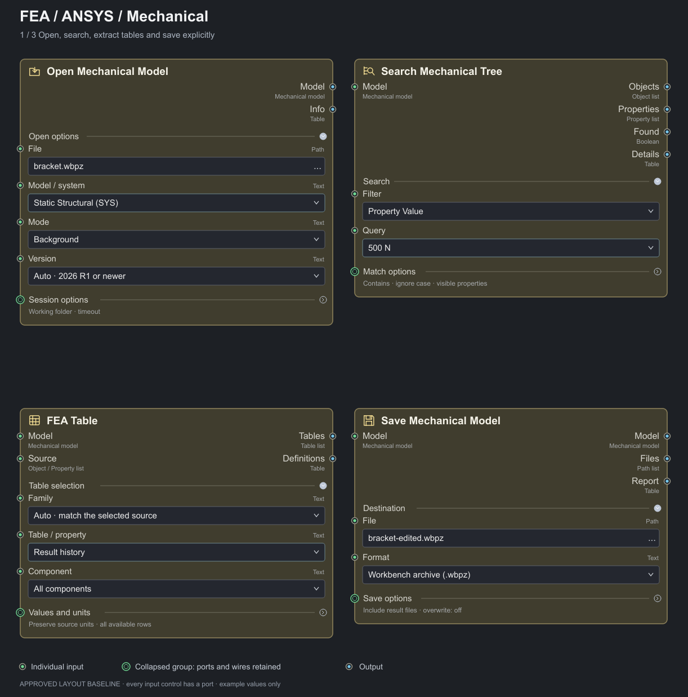
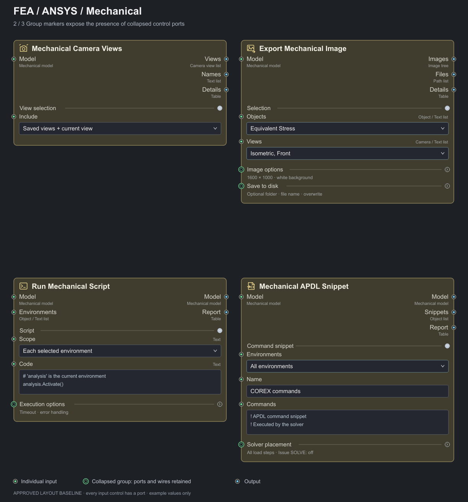
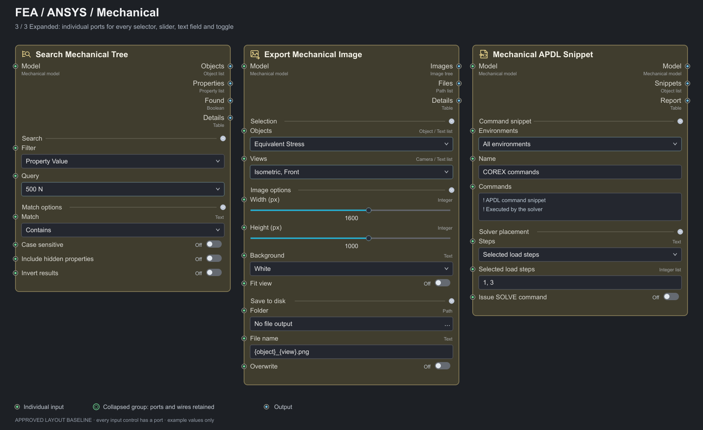
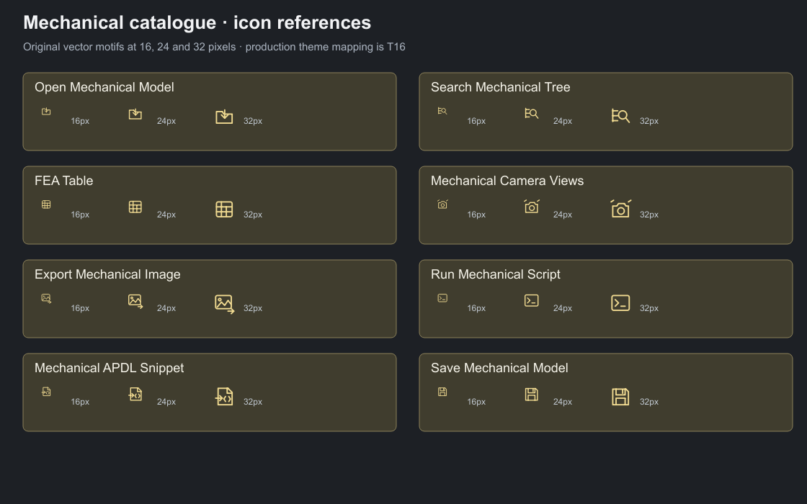

# Mechanical Catalogue — Saved Visual Baseline

The user approved the eight-node layout after requiring a port for **every input control**. The saved images include the corrected group markers on collapsed sections and individual ports on expanded controls. The default Open mode label is updated to **Background**, as agreed when Workbench ownership was clarified. The 2026-09-07 release amendment updates only the Version example label to **Auto · 2026 R1 or newer**; the approved layout and port/group structure remain unchanged.

These are original design-intent drawings, not screenshots of implemented COREX nodes or proof of Ansys behavior. The actual production QML comparison and interactions are T16 acceptance work.

## Saved images

| Reference | Covers | Editable source |
| --- | --- | --- |
| [01 — Open, Search, FEA Table, Save](visuals/01-catalogue.png) | Four node cards; ordinary/default sections and collapsed group-port markers. | [SVG](visuals/01-catalogue.svg) |
| [02 — Views, Image Export, Script, Snippet](visuals/02-catalogue.png) | Remaining four nodes with typed main ports and grouped options. | [SVG](visuals/02-catalogue.svg) |
| [03 — Expanded controls](visuals/03-catalogue.png) | Search, Image Export and Snippet with input ports beside every shown selector, text field, slider and toggle. | [SVG](visuals/03-catalogue.svg) |
| [04 — Icon reference sheet](visuals/04-icons.png) | Eight original vector motifs shown at 16, 24 and 32 pixels. | [SVG](visuals/04-icons.svg) |









## What the implementation must match

- Node identity, icon motif, main input/output label grouping, section names/order and the initially expanded/collapsed sections.
- Every input editor/control has one real typed port. Do not duplicate a port once in the main rail and again beside the same editor.
- Collapsed sections show the existing shared group marker. Wires/port IDs remain intact and return to their separate anchors when expanded.
- Use shared COREX node chrome, fonts, borders, spacing and controls. Do not hard-code these SVG pixel coordinates or colors into Mechanical-specific QML.
- The drawings deliberately use an enlarged readable presentation. Validate production geometry at graph font sizes 10 and 16 and supported display scaling instead of blindly requiring a 1:1 pixel match to the presentation sheet.
- Compare actual QML captures for clipping, overlap, label truncation, port/editor alignment, notches, connected read-only values, conditional controls and expansion animation. Numeric geometry tests alone are insufficient.
- Validate icons in dark and light themes at 16/24/32 pixels. Preserve distinct meanings: open folder/model, tree search, table, camera views, image export, terminal/script, inserted command document and save. These are COREX-owned motifs; do not substitute vendor artwork.

## Contract refinements after the layout review

The full [PLAN.md](PLAN.md) owns types, defaults and runtime behavior. It includes the later clarified decisions without changing the approved grouping:

- The source is reloaded on every graph run; no unsaved state accumulates across runs.
- Search reports tabular-definition presence only; FEA Table performs extraction. No table-cell or whole-table search.
- Search now uses the user's selected COREX-owned background queries. The eleven category labels stay; Query hints disclose explicit coordinate assignments, current document/opaque source IDs, body visibility flags and current scoping. Native partial/lost-scoping detection and indirect association behavior are not promised. See [backend definitions](BACKEND_DECISIONS.md) for the complete difference table; no extra control or regrouping is needed.
- Version stores an integer release code behind its label. Auto selects the newest discovered release code >=261; 261 is the sole initial reference/acceptance release and later releases require the capability handshake. Model/image/table selectors use explicit typed unions and real lists; visible comma-separated sample text is not a serialization format.
- FEA Table Rows/sets represents stored-set IDs. It evaluates selected existing result data automatically and never launches a solve.
- Image export has fixed every-object × every-view behavior, so it needs no Batch mode control. Multiple model items require separate grafted branches; each invocation/object has a distinct output branch.
- Save infers format from the destination extension. Standalone archives are `.mechpz`; Workbench archives are `.wbpz`. Selected Workbench export to `.mechdb`/`.mechdat` is model-only, and `.mechpz` is rejected for Workbench sources with guidance to choose `.wbpz`. Save options retain typed Boolean ports for result/solution files, user files, and Workbench external imported files; all default On, while inapplicable controls remain visible but disabled and unconsumed. The approved collapsed layout does not change.
- Some display type captions in the reviewed drawings are intentionally readable shorthand; the exact port declarations in PLAN.md supersede shorthand such as Text for a release selector. A material new control/port or regrouping still requires a new visual review.

## Source and regeneration

- [design-source.json](visuals/design-source.json) records the review drawing's node/card data.
- [render_previews.py](visuals/render_previews.py) renders the saved SVG sheets to PNG using the existing project Qt installation. It starts neither COREX nor Mechanical.
- [manifest.json](visuals/manifest.json) records SHA-256 values of the reference assets, so a future implementation agent can distinguish the approved baseline from an accidental edit.

From the repository root:

```powershell
.\venv\Scripts\python.exe .\docs\PLANS\MECHANICAL_CATALOGUE\visuals\render_previews.py
```

The eight editable icon files are [Open](visuals/icons/open.svg), [Search](visuals/icons/search.svg), [Table](visuals/icons/table.svg), [Views](visuals/icons/views.svg), [Image](visuals/icons/image.svg), [Script](visuals/icons/script.svg), [Snippet](visuals/icons/snippet.svg), and [Save](visuals/icons/save.svg). They remain planning references until T16 promotes them into the production icon pipeline with its existing checks.
